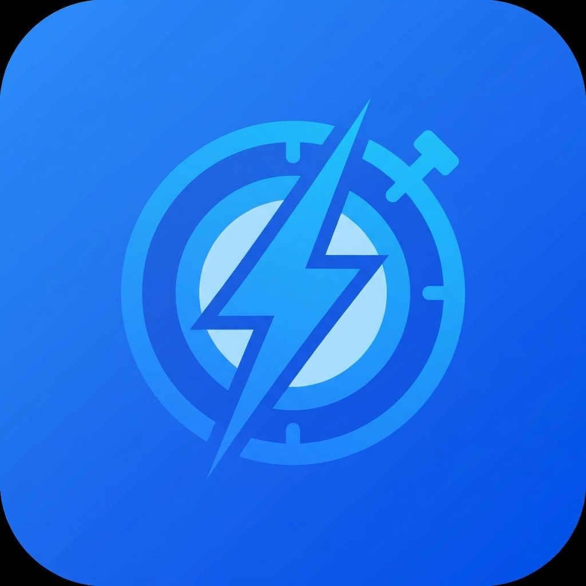

# Quoril - Desktop Productivity App

A production-ready desktop application for task management and focus tracking, built with Electron, React, TypeScript, and Supabase.



## 🚀 Quick Start

### Prerequisites
- Node.js 18+ 
- npm or yarn
- Supabase account (credentials already configured)

### Installation

```bash
# Install dependencies
npm install

# Start development server
npm run dev
```

The Electron app will launch automatically with hot reload enabled.

## 📦 Tech Stack

- **Desktop Framework:** Electron 28
- **Frontend:** React 18 + TypeScript
- **Build Tool:** Vite 5
- **Styling:** TailwindCSS 3
- **State Management:** Zustand
- **Server State:** React Query
- **Backend:** Supabase (PostgreSQL + Auth + Realtime)
- **Icons:** Lucide React
- **Routing:** React Router v6

## 🏗️ Project Structure

```
blitzit-clone/
├── electron/              # Electron main and preload processes
│   ├── main/             # Main process (window, tray, IPC)
│   └── preload/          # Preload scripts (secure bridge)
├── src/
│   ├── components/       # React components
│   │   ├── auth/        # Authentication screens
│   │   └── layout/      # Layout components (Sidebar, etc.)
│   ├── hooks/           # Custom React hooks
│   ├── providers/       # Context providers
│   ├── services/        # API services (Supabase)
│   ├── store/           # Zustand stores
│   ├── types/           # TypeScript types
│   ├── utils/           # Utility functions
│   └── constants/       # App constants
├── public/              # Static assets
└── dist-electron/       # Compiled Electron code
```

## 🎯 Features

### ✅ Completed
- [x] Electron desktop app with system tray
- [x] User authentication (email/password)
- [x] Dark/light theme switching
- [x] Responsive sidebar navigation
- [x] Error boundaries and error handling
- [x] Type-safe database operations
- [x] State management (Auth, UI, Tasks, Focus)
- [x] IPC communication for native features

### 🚧 In Progress
- [ ] Dashboard with stats widgets
- [ ] Task management (CRUD operations)
- [ ] Focus timer (Pomodoro)
- [ ] Calendar/planner view
- [ ] Analytics and reports

## 🔧 Available Scripts

```bash
# Development
npm run dev              # Start dev server with Electron

# Building
npm run build            # Build for production
npm run dist             # Create distributable packages
npm run dist:win         # Build for Windows
npm run dist:mac         # Build for macOS
npm run dist:linux       # Build for Linux

# Code Quality
npm run lint             # Run ESLint
```

## 🔐 Environment Variables

Create a `.env` file in the root directory:

```env
VITE_SUPABASE_URL=your_supabase_url
VITE_SUPABASE_ANON_KEY=your_supabase_anon_key
```

**Note:** Credentials are already configured for this project.

## 🗄️ Database Setup

The app uses Supabase with the following tables:
- `profiles` - User profiles
- `lists` - Task lists
- `tasks` - Individual tasks
- `subtasks` - Task subtasks
- `tags` - Task tags
- `task_tags` - Task-tag relationships
- `focus_sessions` - Focus timer sessions
- `user_preferences` - User settings

All tables have Row Level Security (RLS) enabled.

## 🎨 UI Components

### Layout
- **Sidebar:** Navigation, search, user profile, theme toggle
- **Layout:** Main wrapper with sidebar and content area
- **ErrorBoundary:** Graceful error handling

### Authentication
- **LoginScreen:** Beautiful login/signup form with validation

### Theme
- Light mode
- Dark mode
- System preference detection

## 🔌 Electron Features

### Window Management
- Minimize, maximize, close controls
- Hide to tray (macOS)
- Custom title bar

### System Tray
- Show/hide app
- Quick actions
- Start focus session
- Quit application

### IPC Communication
- Secure context bridge
- Window controls
- Notifications
- File operations
- App metadata

## 📱 Keyboard Shortcuts

- `⌘K` / `Ctrl+K` - Quick search (planned)
- `⌘N` / `Ctrl+N` - New task (planned)
- `⌘,` / `Ctrl+,` - Settings (planned)

## 🧪 Testing

```bash
# Unit tests (TODO)
npm run test

# E2E tests (TODO)
npm run test:e2e
```

## 📦 Building for Production

### Windows
```bash
npm run dist:win
```
Creates `.exe` installer in `dist/`

### macOS
```bash
npm run dist:mac
```
Creates `.dmg` file in `dist/`

### Linux
```bash
npm run dist:linux
```
Creates `.AppImage` in `dist/`

## 🐛 Troubleshooting

### Dev server won't start
```bash
# Clear node_modules and reinstall
rm -rf node_modules package-lock.json
npm install
```

### Electron window doesn't open
- Check that `dist-electron/main/index.js` exists
- Verify `package.json` main field points to correct file
- Check console for errors

### Database connection issues
- Verify `.env` file exists with correct credentials
- Check Supabase project is active
- Ensure RLS policies are configured

## 📚 Documentation

- [Implementation Plan](./implementation_plan.md) - Technical architecture
- [Task Breakdown](./task.md) - Development roadmap
- [Walkthrough](./walkthrough.md) - Progress report

## 🤝 Contributing

This is a personal project, but suggestions are welcome!

## 📄 License

MIT License - feel free to use this code for your own projects.

## 🙏 Acknowledgments

- Inspired by productivity apps like Blitzit
- Built with modern web technologies
- Powered by Supabase

---

**Status:** ✅ Foundation complete, actively developing features

**Last Updated:** February 3, 2026
