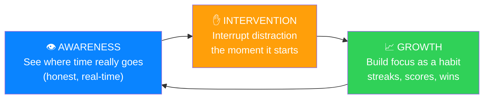
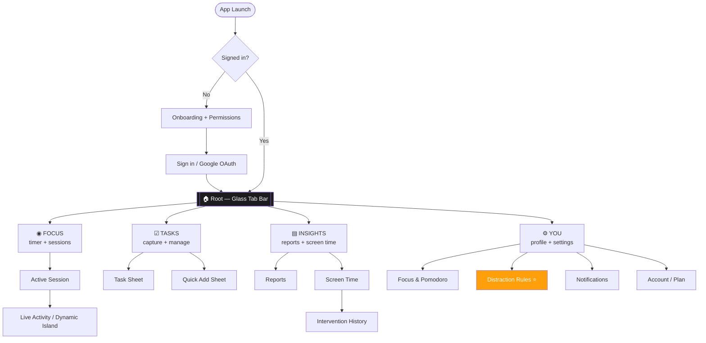
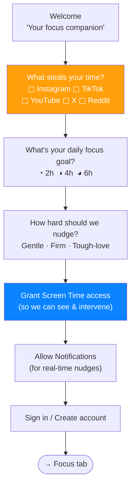
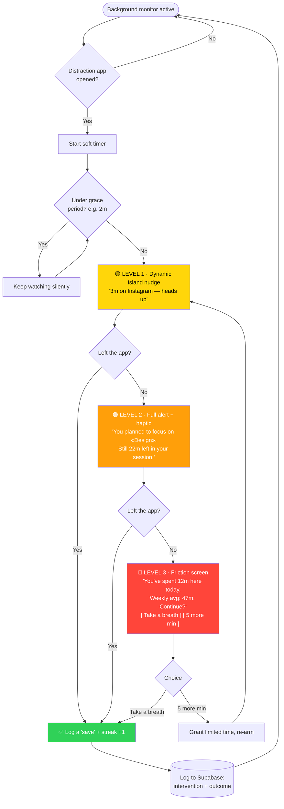
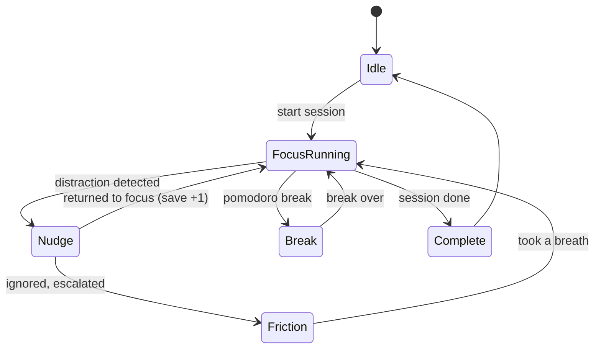
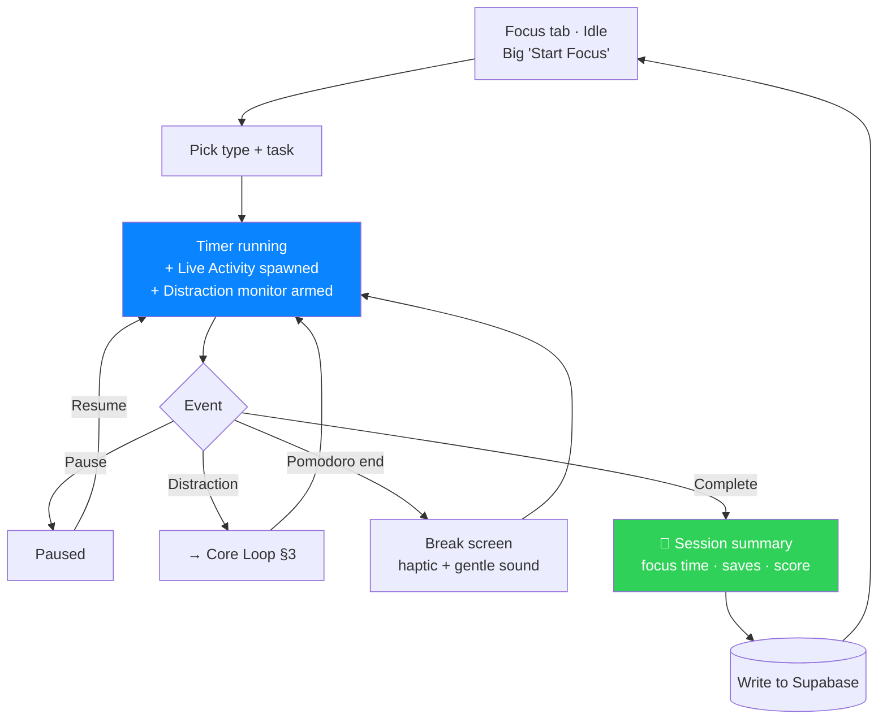
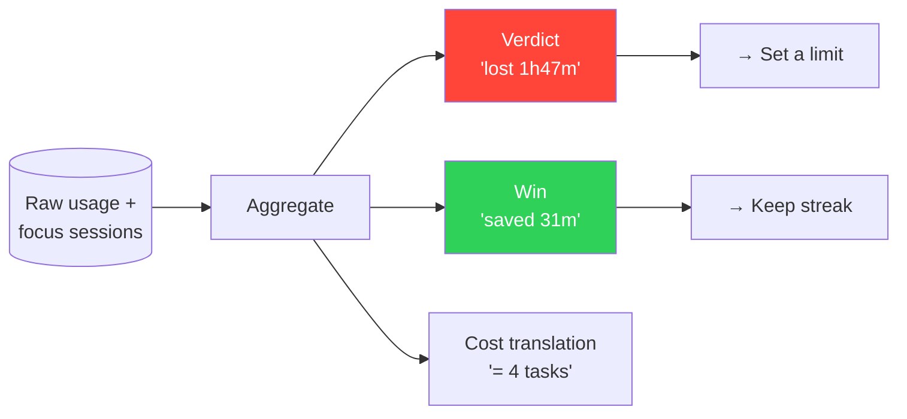
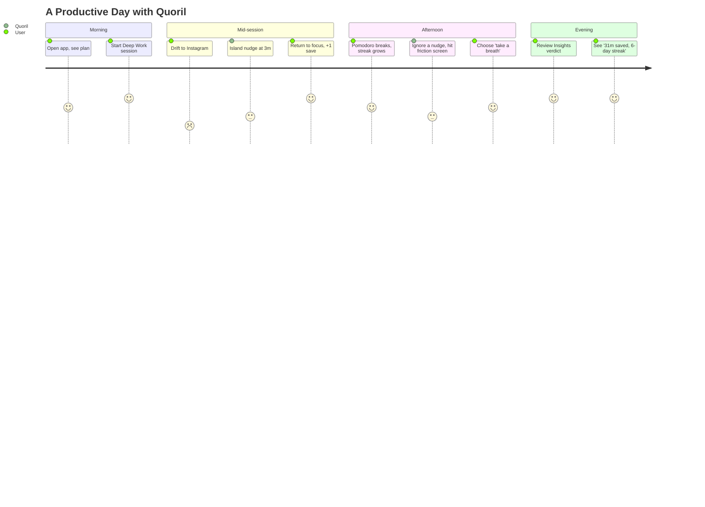
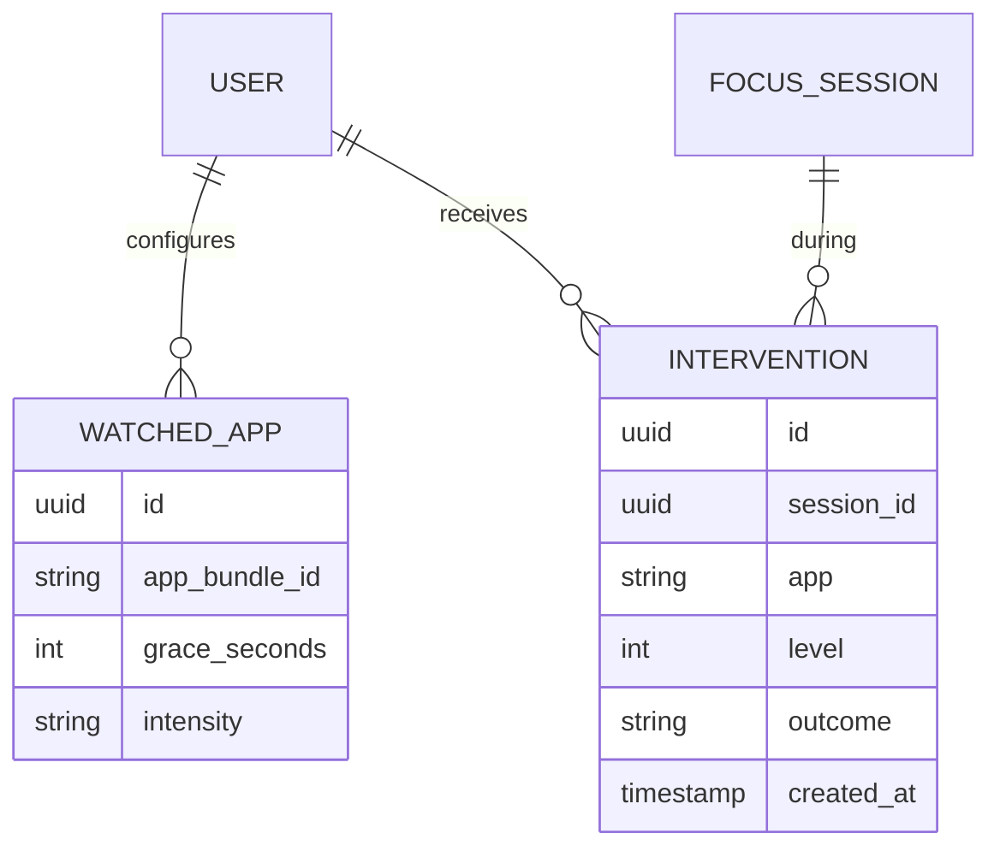

# Quoril Mobile — Visual Flows & Screen Design

> Render the mermaid blocks at https://mermaid.live or in any Markdown viewer that supports mermaid (GitHub, Obsidian, VS Code + Mermaid ext).
> ASCII wireframes show the actual screen layouts. This document is the *thinking made visible*.

---

## 0. The Product Thesis (what makes Quoril different)

Most "screen time" apps are **passive rear-view mirrors** — they show you a report at the end of the day, after the damage is done. Quoril is an **active co-pilot**: it notices the moment you drift into Instagram reels and *intervenes in real time* — a Dynamic Island nudge, a gentle friction, a reminder of what you were supposed to be doing.

> **One line:** *Quoril doesn't just tell you that you wasted 2 hours. It taps you on the shoulder at minute 3 and asks: "Is this what you wanted to be doing right now?"*

The three pillars:



---

## 1. App Map (navigation architecture)



⭐ **Distraction Rules** is the settings screen unique to Quoril — where the intervention engine is configured.

---

## 2. Onboarding Flow (sets up the intervention engine)

Onboarding isn't a tour — it's *permission + intent capture*. We ask the user what they're trying to escape.



**Wireframe — the "what steals your time?" step:**

```
┌───────────────────────────────┐
│                               │
│   What pulls you away?        │  ← Large Title, SF Pro Bold
│   Pick the apps that steal    │  ← secondaryLabel
│   your focus.                 │
│                               │
│   ┌───────────┐ ┌───────────┐ │
│   │ ◉ Instagram│ │ ○ TikTok  │ │  ← glass toggle chips
│   └───────────┘ └───────────┘ │
│   ┌───────────┐ ┌───────────┐ │
│   │ ◉ YouTube │ │ ○ X       │ │
│   └───────────┘ └───────────┘ │
│   ┌───────────┐ ┌───────────┐ │
│   │ ○ Reddit  │ │ ＋ Add     │ │
│   └───────────┘ └───────────┘ │
│                               │
│   ╭───────────────────────╮   │
│   │       Continue        │   │  ← capsule primary btn
│   ╰───────────────────────╯   │
└───────────────────────────────┘
```

---

## 3. ⭐ THE CORE LOOP — Distraction Interception

This is the app. Everything else supports this. A background monitor watches app usage; when a "distraction" app crosses a threshold, Quoril escalates through friction levels.



**Key design principle — escalating friction, never a hard block.** We *inform and nudge*, we don't lock the phone (that breeds resentment and uninstalls). The user always keeps agency; Quoril just makes the distracted choice a *conscious* one.

---

## 4. Dynamic Island / Live Activity — the intervention surface

The Dynamic Island is where Quoril lives while you work. Three jobs: show the focus session, celebrate saves, and deliver nudges.



**Dynamic Island states (ASCII):**

```
COMPACT (focus running)          EXPANDED (tap)
   ●  24:59  🎯                  ┌─────────────────────────┐
                                 │ 🎯 Deep Work · Design    │
                                 │      24:59               │
NUDGE (distraction)              │  ▓▓▓▓▓▓▓░░░  62%          │
   ⚠️  Instagram 3m              │ [ Pause ]     [ Done ]   │
                                 └─────────────────────────┘

FRICTION (escalated)             SAVE (returned to focus)
   🔴 12m today — enough?         ✅ Nice save · 🔥 5 streak
```

---

## 5. Focus Session Flow



**Wireframe — Focus running (hero screen):**

```
┌───────────────────────────────┐
│  Focus                    ⋯   │
│                               │
│         ╭───────────╮         │
│        ╱   24:59     ╲        │  ← ring: systemBlue, monospaced numerals
│       │  Deep Work   │        │
│        ╲  ▓▓▓▓░ 62%  ╱        │
│         ╰───────────╯         │
│                               │
│     🎯  Designing the app     │  ← current task chip
│                               │
│   🛡  Protected · 2 saves     │  ← today's distraction-blocks count
│                               │
│   ╭─────────╮   ╭─────────╮   │
│   │  Pause  │   │  Done   │   │  ← glass controls
│   ╰─────────╯   ╰─────────╯   │
└───────────────────────────────┘
```

---

## 6. Insights — turning data into a verdict

Reports don't just show numbers; they deliver a **verdict** and a **next action**. The Screen Time tab foregrounds distractions and the *cost* of them.

**Wireframe — Insights · Screen Time (distraction-forward):**

```
┌───────────────────────────────┐
│  Insights                     │
│  [ Reports | Screen Time ]    │
│                               │
│  ┌───────────────────────────┐│
│  │ Today you lost            ││  ← the headline verdict
│  │   1h 47m to distractions  ││  ← systemRed number, big
│  │   ↓ 22m better than avg   ││  ← green delta = encouragement
│  └───────────────────────────┘│
│                               │
│  Where it went                │
│  ▸ Instagram      54m  ▓▓▓▓▓  │  ← per-app bars, red-tinted
│  ▸ YouTube        38m  ▓▓▓    │
│  ▸ TikTok         15m  ▓      │
│                               │
│  🛡 Quoril saved you          │
│     31m today · 🔥 6-day      │  ← the "win" framing
│     streak                    │
│                               │
│  ┌───────────────────────────┐│
│  │ That 1h47m ≈ finishing    ││  ← relatable cost translation
│  │ 4 focus tasks. Reclaim it?││
│  │        [ Set a limit → ]  ││
│  └───────────────────────────┘│
└───────────────────────────────┘
```



---

## 7. Distraction Rules (the config screen — Quoril's signature)

```
┌───────────────────────────────┐
│  ‹ Distraction Rules          │
│                               │
│  WATCHED APPS                 │
│  ┌───────────────────────────┐│
│  │ Instagram          ▸ 2m   ││  ← grace period per app
│  │ TikTok             ▸ 1m   ││
│  │ YouTube            ▸ 5m   ││
│  │ ＋ Add app                ││
│  └───────────────────────────┘│
│                               │
│  NUDGE INTENSITY              │
│  ┌───────────────────────────┐│
│  │ ○ Gentle                  ││
│  │ ◉ Firm                    ││  ← segmented / radio
│  │ ○ Tough-love              ││
│  └───────────────────────────┘│
│                               │
│  SCHEDULE                     │
│  ┌───────────────────────────┐│
│  │ Focus hours   9:00–18:00  ││  ← only intervene when working
│  │ Days          Mon–Fri     ││
│  └───────────────────────────┘│
└───────────────────────────────┘
```

---

## 8. End-to-End User Journey (a day with Quoril)



---

## 9. Data Model Additions (for the intervention engine)

The existing Supabase schema covers tasks/focus/apps. Interventions need a little more:



- `outcome` ∈ {returned, snoozed, ignored} → powers the "saves" streak and the Insights win-framing.
- Everything stays offline-first → Drift → Supabase, same sync loop as desktop.

---

## 10. Why this feels professional (design principles recap)

1. **Real-time > retrospective.** The intervention loop (§3) is the moat. No competitor nudges *in the moment* with this restraint.
2. **Nudge, never jail.** Escalating friction preserves user agency → trust → retention.
3. **Frame wins, not shame.** "Saved 31m · 6-day streak" beats "you wasted 2h." Guilt drives uninstalls; progress drives habit.
4. **Apple-native surface.** Dynamic Island + Live Activities make the intervention feel like a *system feature*, not a nagging third-party app.
5. **Cost translation.** "1h47m = 4 tasks" turns abstract minutes into felt loss — the behavioral hook.
```
